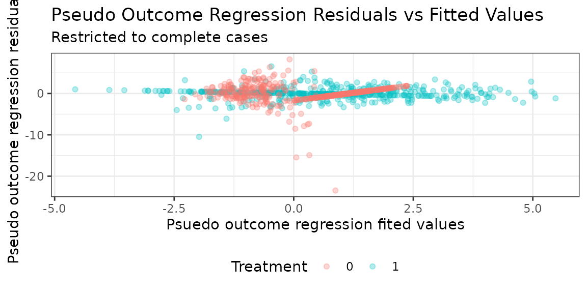

# \`drcmd\`: Doubly-Robust Causal Inference with Missing Data

**Note**: Package is still in development. *Exercise caution* while
using this package until it’s been fully developed, and please check
back frequently for updates.

## Introduction

The `drcmd` `R` package performs semi-parametric efficient estimation of
causal effects of point exposures in settings where the data available
to the researcher is subject to missingness. By implementing methods
from semi-parametric theory and missing data (see, e.g. Robins et al.
(1994) and Kennedy (2024)), `drcmd` accommodates general patterns of
missing data, while enabling users to estimate nuisance functions with
flexible machine learning methods. `drcmd` automatically determines the
missingness patterns present in user-supplied data, and provides
information on assumptions that must hold regarding the missingness
mechanisms in order for point estimates and inferences to be valid. By
accommodating *general* patterns of missingness, `drcmd` serves as a
centralized library for researchers aiming to perform causal inference
with missing data.

The use of doubly-robust methods for performing causal inference of
point exposures on outcomes of interest has surged over the past decade,
and numerous software packages have been developed for implementing
these estimators. While these packages are well-suited for use on
complete, missingness-free data, leading statistical software packages
provide little to no support for missing data. The lack of a centralized
package for performing doubly-robust causal inference has functioned as
a severe impediment for researchers, as missing data is ubiquitous in
real-world data, and the specific patterns of missingness can greatly
vary across applications. `drcmd` addresses this shortcoming by
providing a single R package for performing doubly-robust causal
inference in the presence of general missing data patterns.

## Getting started

### Installation

`drcmd` is hosted on GitHub. The latest version be installed through the
`devtools` package:

``` r

devtools::install_github('keithbarnatchez/drcmd')
```

### Illustrative example

To illustrate the use of the `drcmd` package, we will consider a missing
data problem where the outcome of interest $`Y`$ is missing at random
conditional on measured covariates. We will assume a cheap, noisy proxy
measurement for $`Y`$, denoted $`Y^*`$, is available for all subjects
but not predictive of missingness (so that it is not necessary to
satisfy the MAR assumption), resulting in the following simple data
generating process:

``` math
\begin{aligned}
X & \sim N(0,1) \ \ \ \ \ \  &\text{(Covariates)} \\
A|X & \sim \text{Bernoulli}(p = \text{logit}^{-1}(X)) \ \ \ \ \ \  &\text{(Treatment)} \\
Y|A,X & \sim N(\mu=A + X + AX, \sigma^2=1) \ \ \ \ \ \  &\text{(Outcome)} \\
Y^* & = Y + \varepsilon, \ \varepsilon \sim N(\mu=0,\sigma^2 = 1/4) \ \ \ \ \ \  &\text{(Outcome Proxy)} \\
R &\sim \text{Bernoulli}(\text{logit}^{-1}(X)) \ \ \ \ \ \  &\text{(Complete case Indicator)} \\
\end{aligned}
```
$`Y`$ is only available when the complete case indicator $`R=1`$, and
the missing at random assumption implies $`Y \perp R | X`$. We simulate
data from this model below:

``` r

n <- 1e3
X <- rnorm(n) ; A <- rbinom(n,1,plogis(X)) ; Y <- rnorm(n) + A + X + A*X
Ystar <- Y + rnorm(n)/2 ; R <- rbinom(n,1,plogis(X)) ; X <- as.data.frame(X)
Y[R==0] <- NA # Make Y NA if R==0

df <- data.frame(Y=Y,A=A,X=X,Ystar=Ystar,R=R)
head(df)
```

    ##           Y A            X      Ystar R
    ## 1        NA 0 -1.400043517 -1.7855709 0
    ## 2        NA 0  0.255317055 -0.3332133 0
    ## 3        NA 0 -2.437263611 -4.6215099 0
    ## 4 -1.539838 0 -0.005571287 -2.6864287 1
    ## 5        NA 0  0.621552721  0.4344233 0
    ## 6        NA 1  1.148411606  4.5822774 0

The main function from the `drcmd` package is
[`drcmd()`](https://kbarnatchez.com/drcmd/reference/drcmd.md). The core
arguments are `Y`, `A` and `X`, representing the outcome, binary
treatment and covariates. Users can optionally specify proxy variables
`W` that are (i) predictive of the missing variables, (ii) possibly
influence the missingness mechanism, and (iii) wouldn’t be involved in
the causal analysis under the presence of complete data. Such variables
commonly arise in semi-supervised inference, where cheap proxies are
often available for expensive-to-measure variables. In our running
example, we have that $`Y^*=W`$. In practice, $`W`$ can be
multi-dimensional when multiple proxies are available. `W` defaults to
`NA` when not specified by the user, consistent with settings where
proxies are not available.

Missing data are allowed in the outcome, treatment, and covariates
(including any subset of covariates), as well as any combination of the
three. The only requirement for running `drcmd` is that there exists at
*least* one variable that is never missing, either in `Y`, `A`, `X`,
`W`. `drcmd` detects missingness patterns in the data and automatically
creates a variable `R`, where `R=1` if the observation is a
complete-case and `R=0` if the observation is missing. Note that this
does **not** guarantee identifiability of the causal estimands
$`\mathbb{E}[Y(1)]`$ or $`\mathbb{E}[Y(0)]`$. The validity of the
resulting estimates hinges on the MAR assumption holding, a crucial
problem-specific determination.

Along with specifying variables, users must specify means by which to
estimate all nuisance functions. All nuisance functions are estimated
through a Super Learner (a stacking algorithm) using the `SuperLearner`
package. There are 4 nuisance functions that are fit by `drcmd`, for
$`a = 0,1`$:

``` math
\begin{aligned}
&1. \  m_a(X) = \mathbb{E}(Y|A=a,X) \\
&2. \ g_a(X) = \mathbb{P}(A=a|X) \\
&3. \ r(Z)  = \mathbb{P}(R=1|Z) \\
&4. \ \varphi_a(Z) = \mathbb{E}(\chi_a(X,A,Y) | Z, R=1),
\end{aligned}
```

where $`\chi_a(X) = m_a(X) + \frac{I(A=a)}{g_a(X)}(Y-m_a(X))`$ is the
*pseudo-outcome* formed by the efficient influence function for
estimating the counterfactual mean functional
$`\mathbb{E}[\mathbb{E}(Y|A=a,X)]`$, and $`Z`$ collects all variables
that are never subject to missingness (and are always available,
regardless of whether $`R=1`$ or $`R=0`$). `drcmd` automatically
determines the variables comprising $`Z`$.

Users can specify learners for each nuisance function through the
nuisance-specific arguments below, or set a common library for all of
them through `default_learners`. A nuisance-specific argument overrides
`default_learners` for that function.

| Argument | Nuisance function | Role |
|----|----|----|
| `m_learners` | $`m_a(X) = \mathbb{E}(Y\mid A=a,X)`$ | Outcome regression |
| `g_learners` | $`g_a(X) = \mathbb{P}(A=a\mid X)`$ | Treatment propensity score |
| `r_learners` | $`r(Z) = \mathbb{P}(R=1\mid Z)`$ | Complete-case (missingness) propensity score |
| `po_learners` | $`\varphi_a(Z)`$ | Pseudo-outcome regression |
| `default_learners` | — | Library applied to any nuisance not given its own argument |

Each argument takes a vector of `SuperLearner` library names, using the
same syntax one passes directly into `SuperLearner`. To see the base
libraries available, users can run
[`get_sl_libraries()`](https://kbarnatchez.com/drcmd/reference/get_sl_libraries.md):

``` r

drcmd::get_sl_libraries()
```

    ##  [1] "SL.bartMachine"      "SL.bayesglm"         "SL.biglasso"        
    ##  [4] "SL.caret"            "SL.caret.rpart"      "SL.cforest"         
    ##  [7] "SL.earth"            "SL.gam"              "SL.gbm"             
    ## [10] "SL.glm"              "SL.glm.interaction"  "SL.glmnet"          
    ## [13] "SL.ipredbagg"        "SL.kernelKnn"        "SL.knn"             
    ## [16] "SL.ksvm"             "SL.lda"              "SL.leekasso"        
    ## [19] "SL.lm"               "SL.loess"            "SL.logreg"          
    ## [22] "SL.mean"             "SL.nnet"             "SL.nnls"            
    ## [25] "SL.polymars"         "SL.qda"              "SL.randomForest"    
    ## [28] "SL.ranger"           "SL.ridge"            "SL.rpart"           
    ## [31] "SL.rpartPrune"       "SL.speedglm"         "SL.speedlm"         
    ## [34] "SL.step"             "SL.step.forward"     "SL.step.interaction"
    ## [37] "SL.stepAIC"          "SL.svm"              "SL.template"        
    ## [40] "SL.xgboost"          "SL.hal9001"

This list includes `SL.hal9001`, a wrapper for the highly-adaptive LASSO
(HAL). Users can additionally create custom libraries, and are
encouraged to consult the `SuperLearner` package documentation for
further details.

#### Cautionary note: weighted regressions

The nuisance functions $`m_a`$ and $`g_a`$ are estimated with
regressions that add weights $`R/\mathbb{P}(R=1|Z)`$ to the underlying
loss functions. In turn, *libraries that do not support (or ignore)
weights will tend to yield biased estimates*. Users are encouraged to
ensure all libraries used support weights.

## Using `drcmd`

### Calling the `drcmd` function

Below we demonstrate an example call of
[`drcmd()`](https://kbarnatchez.com/drcmd/reference/drcmd.md), which
requires users to provide an outcome `Y`, binary treatment `A`,
covariate dataframe `X`, and SuperLearner libraries. We make use of the
`default_learners` argument to specify SuperLearner libraries for all
nuisance functions, estimating each through an ensemble of generalized
linear models (GLMs) and generalized additive models (GAMs).

``` r

res <- drcmd::drcmd(Y=Y, A=A, X=X,
             default_learners=c('SL.glm','SL.gam'),
             quiet=FALSE)
```

To make use of the additional proxy variable, we can simply specify the
`W` argument in the call to
[`drcmd()`](https://kbarnatchez.com/drcmd/reference/drcmd.md). In
general, `W` can be multidimensional. In our running example, we have
that $`Y^*=W`$.

``` r

res <- drcmd::drcmd(Y=Y, A=A, X=X, W=data.frame(Ystar),
             default_learners=c('SL.gam'))
```

Users can specify specific learners through nuisance-specific arguments,
which will overwrite the learners specified in `default_learners` for
that particular nuisance function if `default_learners` is specified.
For example, to estimate the pseudo-outcome regression through GAMs, and
all other nuisance functions with a Super Learner ensemble of GLMs and
splines, we can make the following call to
[`drcmd()`](https://kbarnatchez.com/drcmd/reference/drcmd.md):

``` r

res <- drcmd::drcmd(Y=Y, A=A, X=X,
             default_learners=c('SL.glm','SL.gam'),
             po_learners = 'SL.gam')
```

Alternatively, one can omit specification of `default_learners`
entirely, provided learners are specified for each nuisance function:

``` r

res <- drcmd::drcmd(Y=Y, A=A, X=X,
             m_learners = c('SL.glm','SL.gam'), 
             g_learners = 'SL.mean',
             r_learners = 'SL.glm.interaction',
             po_learners = c('SL.gam','SL.hal9001'))
```

### Outputting results

Users can view a summary of the estimation procedure by calling the
[`summary()`](https://rdrr.io/r/base/summary.html) function, which
provides point estimates, standard errors and 95% CIs for main causal
estimands. By default, `drcmd` obtains estimates of
$`\mathbb{E}[Y(1)]`$, $`\mathbb{E}[Y(0)]`$, and the average treatment
effect (ATE) $`\mathbb{E}[Y(1)-Y(0)]`$. When the outcome is binary,
`drcmd` additionally reports the causal risk ratio
$`\mathbb{E}[Y(1)]/\mathbb{E}[Y(0)]`$ and odds ratio. Standard errors
for these estimands are obtained via the delta method (see the Technical
Details section).

``` r

summary(res)
```

    ## ======================================================================
    ##                         Summary of drcmd results                      
    ## ======================================================================
    ## Estimand            Estimate           SE                     95% CI
    ## ----------------------------------------------------------------------
    ## ATE:                   1.098        0.119             [0.864, 1.331]
    ## E[Y(1)]:               1.116        0.103             [0.915, 1.317]
    ## E[Y(0)]:               0.018        0.090            [-0.158, 0.194]
    ## ----------------------------------------------------------------------
    ## Variables with missingness (U): Y
    ## Variables without missingness (Z): X, A
    ## ----------------------------------------------------------------------
    ## Validity of results requires causal assumptions to hold,
    ## as well as the assumption that U is independent of R given Z

### Extracting output

After running
[`drcmd()`](https://kbarnatchez.com/drcmd/reference/drcmd.md), numerous
objects are stored within the resulting output, including

- `results`: A list containing (i) parameter estimates stored in a
  dataframe named `estimates`, (ii) standard errors stored in a
  dataframe named `ses`, and (iii) nuisance function estimates stored in
  a dataframe named `nuis`
- `params`: A list containing all parameter values used by
  [`drcmd()`](https://kbarnatchez.com/drcmd/reference/drcmd.md)
- `R`: Binary complete case indicator, where 1 denotes a complete case
- `U`: Names of variables with partially missing values
- `Z`: Names of variables with no missing values

Users can obtain a detailed summary by specifying `detail=TRUE` in the
`summary` function:

``` r

summary(res,detail=TRUE)
```

    ## ======================================================================
    ##                         Summary of drcmd results                      
    ## ======================================================================
    ## Estimand            Estimate           SE                     95% CI
    ## ----------------------------------------------------------------------
    ## ATE:                   1.098        0.119             [0.864, 1.331]
    ## E[Y(1)]:               1.116        0.103             [0.915, 1.317]
    ## E[Y(0)]:               0.018        0.090            [-0.158, 0.194]
    ## ----------------------------------------------------------------------
    ## Variables with missingness (U): Y
    ## Variables without missingness (Z): X, A
    ## ----------------------------------------------------------------------
    ## Validity of results requires causal assumptions to hold,
    ## as well as the assumption that U is independent of R given Z
    ## ----------------------------------------------------------------------
    ## Number of cross-fitting folds (k): 1 
    ## Outcome regression nuisance learners: SL.glm SL.gam 
    ## Propensity score nuisance learners: SL.glm SL.gam 
    ## Missingness nuisance learners: SL.glm SL.gam 
    ## Pseudo-outcome nuisance learners: SL.glm SL.gam 
    ## Estimation method: augmented complete case one-step

## Additional parameters

### Cross-fitting

While not enabled by default, users can estimate parameters through
cross-fitting by setting the `k` argument to the desired number of
folds. By default, `drcmd` uses a single fold. Cross-fitting is
encouraged when the user specifies nuisance learners that cover complex
function classes, such as random forests. See the technical details
section for more information on the rationale behind and implementation
of cross-fitting.

When `k > 1`, the folds are independent and can be fit concurrently by
setting `parallel=TRUE`, which distributes them across cores via
[`parallel::mclapply`](https://rdrr.io/r/parallel/mclapply.html) (not
supported on Windows). Separately, the `cv_folds` argument controls the
number of cross-validation folds `SuperLearner` uses internally for
model selection within each fit (default 5); lowering it speeds up
estimation at some cost to learner selection.

``` r

res <- drcmd::drcmd(Y=Y, A=A, X=X,
             default_learners='SL.glm',
             k=3)
```

### Empirical efficiency maximization

In practice, the pseudo-outcome regression function $`\varphi_a(Z)`$
will tend to be an inherently difficult nuisance function to estimate.
While `drcmd` estimates this regression through conventional regression
methods by default, users can optionally fit $`\varphi_a`$ through
empirical efficiency maximization (EEM) by setting the argument
`eem_ind` to `TRUE`. Given an implicitly-defined function class
determined through choice of nuisance learner for $`\varphi_a`$, rather
than attempt to minimize the MSE $`||\hat \varphi_a - \varphi_a||`$, EEM
aims to minimize the variance of the estimator itself. An example
function call is provided below:

``` r

res <- drcmd::drcmd(Y=Y, A=A, X=X,
             default_learners='SL.glm',
             k=1,
             eem_ind=TRUE)
```

Further details on the EEM procedure are provided in the Technical
Details section.

### Targeted maximum likelihood estimation

By default, `drcmd` constructs debiased machine learning estimators
(often called one-step debiased estimators) of counterfactual means and
treatment effects. A alternative, asymptotically equivalent framework
based on targeted maximum likelihood (TML) to construct the final
estimators can be used by setting the `tml` argument to `TRUE`:

``` r

res <- drcmd::drcmd(Y=Y, A=A, X=X,
             default_learners='SL.glm',
             k=1,
             tml=TRUE)
```

When `tml=FALSE` (the default), `drcmd` constructs the final estimator
through a one-step debiased estimator. The two frameworks (one-step and
TML) rely on the same four nuisance function estimates, and only differ
in how they leverage those estimates to construct the final estimator.
Further details are provided in the Technical Details section.

### User-provided complete-case probabilities

In most settings, the probability of an individual observation being a
complete case will be unknown and estimated by `drcmd`. However, in some
study designs (e.g. two-phase sampling designs), complete cases
probabilities are *known* by design and controlled by the researcher. In
these settings, users can provide complete-case probabilities through
the argument `Rprobs`:

``` r

n <- 1e3
X <- rnorm(n) ; A <- rbinom(n,1,plogis(X)) ; Y <- rnorm(n) + A + X
Ystar <- Y + rnorm(n)/2 ; R <- rbinom(n,1,plogis(X)) ; X <- as.data.frame(X)
Y[R==0] <- NA # Make Y NA if R==0

res <- drcmd::drcmd(Y=Y, A=A, X=X,
             default_learners='SL.glm',
             Rprobs=plogis(X))
```

When provided, `drcmd` will use the user-supplied `Rprobs` in place of
estimating $`\mathbb{P}(R=1|Z)`$.

### Trimming of propensity scores

Extreme estimated propensity scores, used to form inverse probability
weights that account for the treatment mechanism and missing data
mechanism, can lead to unstable estimators. To mitigate instability,
`drcmd` truncates propensity scores at the values 0.025 and 0.975 by
default. Users can adjust these values through the `cutoff` argument,
which will truncate propensity scores at the values `cutoff` and
`1-cutoff`. For instance, to avoid truncating weights one can set
`cutoff=0`:

``` r

res <- drcmd::drcmd(Y=Y, A=A, X=X,
             default_learners='SL.glm',
             cutoff=0)
```

### ATT / ATC estimation

While not estimated by default, `drcmd` can additionally estimate the
ATT and/or ATC through the logicals `att` and `atc`. Note that ATT/ATC
estimation is currently supported only with one-step estimation, so it
cannot be combined with `tml=TRUE`.

``` r

res <- drcmd::drcmd(Y=Y, A=A, X=X,
             default_learners='SL.glm',
             att=TRUE,
             cutoff=0)
summary(res)
```

    ## ======================================================================
    ##                         Summary of drcmd results                      
    ## ======================================================================
    ## Estimand            Estimate           SE                     95% CI
    ## ----------------------------------------------------------------------
    ## ATE:                   1.063        0.112             [0.845, 1.282]
    ## E[Y(1)]:               1.091        0.100             [0.895, 1.286]
    ## E[Y(0)]:               0.027        0.086            [-0.142, 0.196]
    ## ATT:                   1.385        0.141             [1.108, 1.661]
    ## ----------------------------------------------------------------------
    ## Variables with missingness (U): Y
    ## Variables without missingness (Z): X, A
    ## ----------------------------------------------------------------------
    ## Validity of results requires causal assumptions to hold,
    ## as well as the assumption that U is independent of R given Z

``` r

res <- drcmd::drcmd(Y=Y, A=A, X=X,
             default_learners='SL.glm',
             atc=TRUE,
             cutoff=0)
summary(res)
```

    ## ======================================================================
    ##                         Summary of drcmd results                      
    ## ======================================================================
    ## Estimand            Estimate           SE                     95% CI
    ## ----------------------------------------------------------------------
    ## ATE:                   1.063        0.112             [0.845, 1.282]
    ## E[Y(1)]:               1.091        0.100             [0.895, 1.286]
    ## E[Y(0)]:               0.027        0.086            [-0.142, 0.196]
    ## ATC:                   0.766        0.122             [0.527, 1.004]
    ## ----------------------------------------------------------------------
    ## Variables with missingness (U): Y
    ## Variables without missingness (Z): X, A
    ## ----------------------------------------------------------------------
    ## Validity of results requires causal assumptions to hold,
    ## as well as the assumption that U is independent of R given Z

### Diagnostic plots

While users can extract output from the results structure to construct
plots manually, `drcmd` comes with numerous built-in plotting functions
to help users diagnose potential issues in the fitting procedure. Users
can specify their desired plot with the `type` argument: (i) `PO`:
residuals of pseudo-outcome regression vs predicted values, (ii) `IC`:
density plots of the influence curves for $`\mathbb{E}[Y(1)]`$,
$`\mathbb{E}[Y(0)]`$ and the ATE, (iii) `g_hat`: Density plots of fitted
treatment propensity scores among complete cases, (iv) `r_hat`: Density
plots of fitted complete case propensity scores among complete cases.

``` r

plot(res,type='PO')
```



Alternatively, users can cycle through all diagnostic plots by leaving
the type argument unspecified or setting it to `'All'`

``` r

plot(res)
```

## Technical Details

### Observed and full data influence functions

`drcmd` leverages developments from semiparametric theory for the
estimation of functionals in the presence of missing data. Key to
semiparametric efficient estimation with missing data is the
conceptualization of (i) the *full-data* distribution one would have
access to in the presence of missing data, and (ii) the *observed* data
distribution one actually has access to. In full generality, suppose
there exists a missingness free distribution one would ideally sample
observations $`F_i`$ from the *full-data distribution* $`\mathbb{P}_F`$:
``` math
F_i \sim \mathbb{P}_\text{F}, \ \ \ \ i=1,\ldots,n,
```
where interest lies in some pathwise differentiable statistical
functional $`\Psi(\mathbb{P}_\text{F})`$ and $`F_i`$ can be decomposed
into $`F_i = (V_i, U_i)`$.

Rather than observe data from $`\mathbb{P}_F`$, we instead observe data
from the *observed-data* distribution $`\mathbb{P}_O`$ containing i.i.d.
observations
``` math
O_i = (W_i, \ V_i, \ R_i U_i, \ R_i)\sim \mathbb{P}_O.
```
Above, $`U_i`$ is only observed when $`R_i=1`$, and $`W_i`$ is observed
for all $`i`$ and contains variables that are (i) possibly predictive of
missingness, and (ii) but not a component of $`F`$, in the sense that
they wouldn’t be used for estimating the target estimand when one has
access to complete data. $`W`$ is closely connected to the notions of
*proxy* and *surrogate* variables.

Letting $`\chi(O, \mathbb{P}_\text{F})`$ denote the efficient influence
curve for $`\Psi(\mathbb{P}_\text{F})`$, the efficient influence curve
for $`\Psi(\mathbb{P}_\text{F})`$ induced by the observed data
distribution can be written
``` math
\chi(O,\mathbb{P}_O) = \frac{R}{\kappa(Z)}\chi(F,\mathbb{P}_\text{F}) - \left(\frac{R}{\kappa(Z)} - 1 \right) \varphi(O) 
```
where $`\varphi(O) = \mathbb{E}[\chi(O,\mathbb{P}_\text{F}) | Z]`$ and
$`\kappa(Z) = \mathbb{P}(R=1|Z)`$. The above representation holds so
long as the missing at random assumption $`U \perp R | Z`$ holds, where
$`Z = (W, V)`$ collects all variables which are always observed.

### Estimation of counterfactual means

Throughout, we will consider the scenario of estimating a generic
counterfactual mean $`\mathbb{E}[Y(a)]`$. Under the core causal
inference assumptions of consistency, positivity, and exchangeability,
the counterfactual mean can be expressed as
``` math
\mathbb{E}[Y(a)] = \psi_a := \mathbb{E}[m_a(X)]
```
where $`m_a(X) = \mathbb{E}[Y|A=a,X]`$ and $`\psi_a`$ is identified
under the complete-data distribution.

To build intuition, return to the earlier outcome proxy example where we
observe
``` math
O_i = (R_i Y_i, A_i, X_i, Y_i^*) \sim \mathbb{P}_O
```
and assume $`Y \perp R | A, X, Y^*.`$ In this setting, the ideal
distribution is given by $`F = (Y, A, X)`$, and notice $`W=Y^*`$,
$`Z = (Y^*, A, X)`$ and $`U = Y`$. It’s well-known that the efficient
influence curve for $`\psi_a`$ under the full-data distribution is given
by
``` math
\chi(F, \mathbb{P}_F) = m_a(X) + \left( \frac{I(A=a)}{\mathbb{P}(A=a|X)} \right) \left( Y - m_a(X) \right) - \psi_a
```
In turn, the observed data EIC, a crucial ingredient for constructing
efficient semiparametric estimators, is given by

``` math
\begin{aligned}
\chi(F, \mathbb{P}_O) &=  \frac{R}{\kappa(Z)}\chi(F,\mathbb{P}_\text{F}) - \left(\frac{R}{\kappa(Z)} - 1 \right) \varphi(O)  \\
&=
\frac{R}{\kappa(Z)}\left\{ m_a(X) + \left( \frac{I(A=a)}{\mathbb{P}(A=a|X)} \right) \left( Y - m_a(X) \right) - \psi_a \right\} - \left(\frac{R}{\kappa(Z)} - 1 \right) \varphi(O)
\end{aligned}
```

We now consider numerous means by which $`\hat \psi_a`$ can be
estimated.

#### Plug-in estimator

Recalling $`m_a(X) = \mathbb{E}[Y|A=a,X]`$, one can construct a plug-in
estimator of $`\psi_a`$ of the form

``` math
\hat \psi_a = \frac{1}{n} \sum_{i=1}^n \hat{m}_a(X_i)
```
above, $`\hat m_a(X)`$ can be estimated through a regression of $`Y`$ on
$`A`$ and $`X`$ which weights the underlying loss function by
$`R/\hat \kappa(Z)`$, where $`\hat \kappa(Z)`$ are estimated complete
case probabilities. In the event that covariates are partially missing,
one can instead implement the plug-in estimator

``` math
\hat \psi_a = \frac{1}{n} \sum_{i=1}^n \left(\frac{R_i}{\hat{\kappa}(Z_i)} \right) \hat{m} \ {}_a(X_i)
```

While the above estimator is straightforward to implement, its
asymptotic distribution is intractable when the above nuisance functions
are estimated with machine learning methods. Specifically, it can be
shown that under modest regularity conditions,

``` math
\hat \psi_a - \psi_a = \frac{1}{n} \sum_{i=1}^n \chi_a(O_i; {\mathbb{P}}_O) - \mathbb{E}\left[  \chi_a(O_i; \hat{\mathbb{P}}_O) \right]+ o_p(n^{-1/2})
```
where $`\chi_a(O_i; \hat{\mathbb{P}}_O)`$ is the efficient influence
curve for $`\psi_a`$ under the *observed* data distribution. The term
$`\mathbb{E}\left[  \chi_a(O_i; \hat{\mathbb{P}}_O) \right]`$ above is
crucial, as it is typically of a slower order than $`n^{-1/2}`$,
invalidating standard asymptotic inference and making the construction
of confidence intervals an intractable task. In turn,
$`\mathbb{E}\left[  \chi_a(O_i; \hat{\mathbb{P}}_O) \right]`$ is
typically referred to as a *plug-in bias* term. `drcmd` allows for
estimators based on two general frameworks that aim to remove this
plug-in bias: one-step estimation and targeted maximum likelihood
estimation.

#### One-step estimation

The default estimation method used by `drcmd` is based on the method of
one-step bias correction. The one-step estimator simply removes the
above plug-in bias by adding its estimate back on to the plug-in:

``` math
\hat \psi_a^\text{OS} = \hat{\psi}_a + \frac{1}{n} \sum_{i=1}^n   \chi_a(O_i; \hat{\mathbb{P}}_O)
```
implying the form

``` math
\hat \psi_a^\text{OS} = \hat \psi_a^\text{PI} +
\frac{1}{n} \sum_{i=1}^n \left[\frac{R_i}{\hat \kappa(Z_i)}\left\{ \hat m_a(X_i) + \left( \frac{I(A_i=a)}{\hat{\mathbb{P}}(A_i=a|X)} \right) \left( Y_i - \hat m_a(X_i) \right) - \hat{\psi}_a^\text{PI} \right\} - \left(\frac{R_i}{\hat \kappa(Z_i)} - 1 \right) \hat\varphi(O_i)\right]
```

#### Empirical efficiency maximization (EEM)

The nuisance function $`\varphi(O)`$, often referred to as the
pseudo-outcome regression function, is an inherently complicated
nuisance function:

``` math
\varphi_a(O) = \mathbb{E}\left[  m_a(X_i) + \left( \frac{I(A_i=a)}{{\mathbb{P}}(A_i=a|X)} \right) \left( Y_i - m_a(X_i) \right) - \psi_a \bigg|  \ Z \ \right] 
```
where $`Z`$ collects all non-missing variables. Particularly when the
relative share of complete cases $`P(R=1)`$ is small, estimation of
$`\varphi_a(O)`$ can be a difficult task. The empirical efficiency
maximization framework is motivated by the finding that (under standard
regularity conditions),

``` math
\hat \psi_a - \psi_a = O_\mathbb{P}\left( \frac{1}{\sqrt n} + ||\hat m_a - m_a|| \cdot ||\hat g_a - g_a|| + ||\hat \kappa - \kappa || \cdot ||\hat \varphi_a - \varphi_a|| \right),
```
meaning that if the complete case probabilities $`\kappa(Z)`$ are
estimated consistently, mis-specification of $`\varphi_a`$ will not
influence bias of the estimator, but *will* hamper efficiency.

#### Targeted maximum likelihood estimation

Recalling the form of the observed data influence curve,

``` math
\chi(O; \mathbb{P}_O) = \frac{R}{\kappa(Z)}\chi(F,\mathbb{P}_\text{F}) - \left(\frac{R}{\kappa(Z)} - 1 \right) \varphi(O),
```
the targeted maximum likelihood approach aims to remove the above
plug-in bias by updating the initial estimates $`\hat \kappa(Z)`$ and
$`\hat m_a(X)`$ in a manner where

1.  The updated estimate $`\hat \kappa^*(Z)`$ is set so that
    ``` math
    \begin{equation}
    \label{eq:tml-1}
     \frac{1}{n} \sum_{i=1}^n \left(\frac{R_i}{\hat \kappa(Z_i)^*} - 1 \right) \hat{\varphi}(O_i) = 0 
     \end{equation}
    ```
2.  Using the updated $`\hat{\kappa}^*(Z)`$, the updated plug-in
    estimate $`\hat{m}_a^*(X)`$ is set so that
    ``` math
    \begin{equation}
    \label{eq:tml-2}
     \frac{1}{n} \sum_{i=1}^n \left\{\frac{R_i}{\hat \kappa(Z_i)^*} \right\}\left(\frac{I(A_i=a)}{\hat g_a(X_i)} (Y_i - \hat m_a^*(X_i) )\right) =0
    \end{equation}
    ```

The final $`\hat{m}_a^*(X_i)`$ is used to construct the final plug-in
estimator

``` math
\hat{\psi}_a^\text{TMLE} = \frac{1}{n} \sum_{i=1}^n \hat m_a^*(X_i)
```

and in the case where the covariates are partially missing, the final
plug-in estimator is given by

``` math
\hat{\psi}_a^\text{TMLE} = \frac{1}{n} \sum_{i=1}^n \left(\frac{R_i}{\hat \kappa(Z_i)^*} \right) \hat{m}_a^*(X_i)
```

Critically, () and () above imply that the plug-in bias of
$`\hat \psi_a^\text{TMLE}`$ is zero, allowing for the same asymptotic
analysis enjoyed by $`\hat \psi_a^\text{OS}`$. TML additionally
guarantees its resulting parameter estimates will respect the bounds of
the parameter space.

#### Standard error estimation

For all estimands in `drcmd`, standard error estimation is based on
asymptotic variance formulae.

**Counterfactual means**: Let $`\hat \psi_a`$ be an estimator of
$`\psi_a = \mathbb{E}[Y(a)]`$, based on the observed data influence
curve $`\chi_a(O,\eta)`$, where $`\eta`$ collects all nuisance functions
and $`\mathbb{E}[\chi_a(O,\eta)]=0`$. It can be shown under modest
regularity conditions on the estimation rates of all nuisance functions
that
``` math
\hat \psi_a - \psi_a = \frac{1}{n} \sum_{i=1}^n \chi_a(O_i, \eta) + o_p(n^{-1/2})
```
In turn, the asymptotic variance of $`\hat \psi_a`$ is given by
$`\mathbb{E}[ \chi_a(O,\eta)^2]`$. Standard error estimates are obtained
by plugging in the empirical influence curve
$`\hat \chi_a(O,\hat \eta)`$ for $`\chi_a(O,\eta)`$:
``` math
\sqrt{\ \frac{1}{n} \sum_{i=1}^n \chi_a(O_i, \hat \eta)^2\ }
```

**Risk ratio**: Let $`\hat \psi_1`$ and $`\hat \psi_0`$ be
asymptotically linear estimators of $`\psi_1`$ and $`\psi_0`$,
respectively, and let
``` math
\Sigma = \begin{pmatrix}
\sigma_1^2 & \nu \\
\nu & \sigma_0^2
\end{pmatrix}
```
be the asymptotic covariance of $`\hat \psi_1`$ and $`\hat \psi_0`$. A
straightforward application of the multivariate delta method implies the
asymptotic variance of the risk ratio estimator
$`\hat \psi_1/\hat \psi_0`$ is given by  
``` math
\begin{aligned}
\nabla g^\top \Sigma \nabla  g
\end{aligned}
```
where $`\nabla g = (1/\psi_0, -\psi_1/\psi_0^2)`$ is the gradient of
$`g(\psi_1,\psi_0) = \psi_1/\psi_0`$. Evaluating the above expression
yields
``` math
\begin{aligned}
\frac{\sigma_1^2}{\psi_0^2} + \frac{\sigma_0^2 \psi_1^2}{\psi_0^4} - \frac{2\nu \psi_1}{\psi_0^3}.
\end{aligned}
```
`drcmd` estimates the above asymptotic variance by substituting plug-in
estimates for each component.

**Odds ratio**: Continue to let $`\hat \psi_1`$ and $`\hat \psi_0`$ be
asymptotically linear estimators of $`\psi_1`$ and $`\psi_0`$,
respectively. One can (i) find the asymptotic variance of the *log* odds
ratio estimator $`\log(\hat \psi_1/\hat \psi_0)`$, and (ii) apply the
delta method an additional time to obtain the asymptotic variance of the
odds ratio estimator
$`\hat \psi_\text{OR} = \hat \psi_1/(1-\hat\psi_1) \big/\hat \psi_0 /(1-\hat \psi_0)`$:

``` math
\begin{aligned}
\psi_\text{OR}^2 \left( \frac{\sigma_1^2}{\psi_1^2(1-\psi_1)^2} + \frac{\sigma_0^2}{\psi_0^2(1-\psi_0)^2} - \frac{2\nu}{\psi_1(1-\psi_1)\psi_0(1-\psi_0)} \right).
\end{aligned}
```

## References

Kennedy, Edward H. 2024. “Semiparametric Doubly Robust Targeted Double
Machine Learning: A Review.” In *Handbook of Statistical Methods for
Precision Medicine*, edited by Eric Laber, Bibhas Chakraborty, Erica E M
Moodie, Tianxi Cai, and Mark van der Laan. Chapman; Hall/CRC.

Robins, James M, Andrea Rotnitzky, and Lue Ping Zhao. 1994. “Estimation
of Regression Coefficients When Some Regressors Are Not Always
Observed.” *Journal of the American Statistical Association* 89 (427):
846–66.
